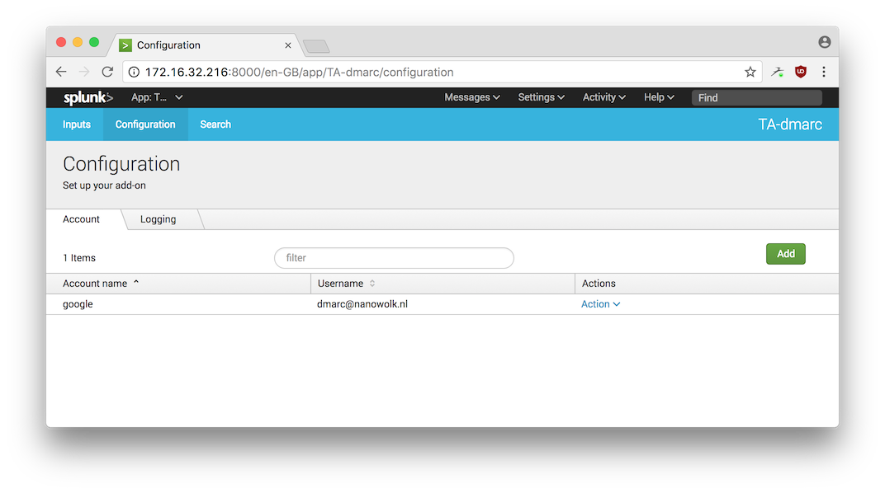
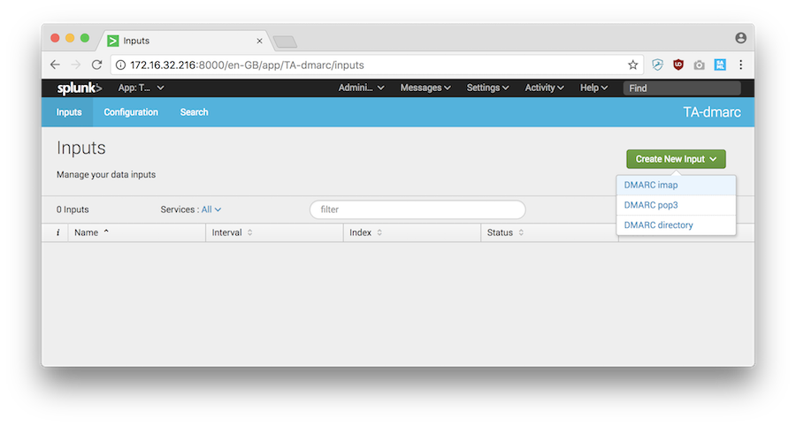
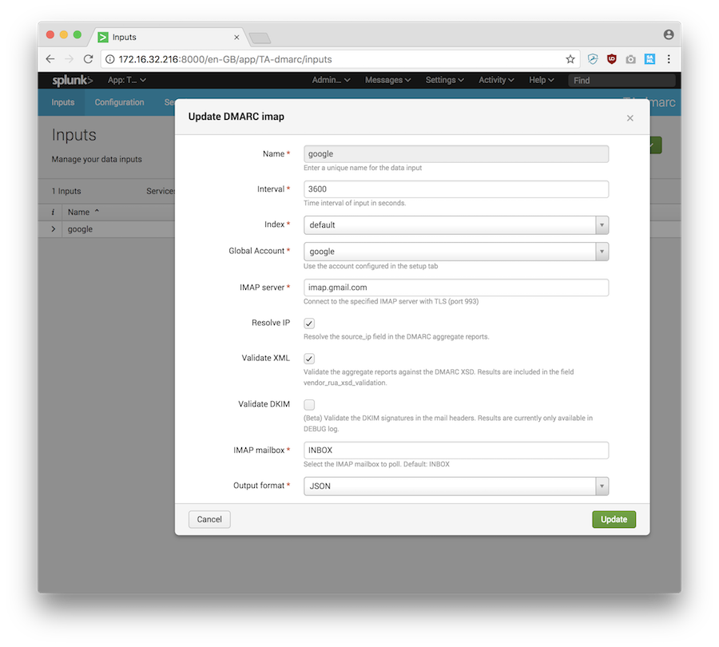

# TA-dmarc add-on for Splunk

TA-dmarc add-on for Splunk supports ingesting DMARC XML aggregate reports from
an IMAP/POP3 mailbox or local directory with mitigations against:

* ZIP bombs
* gzip bombs
* various XML attack vectors like billion laughs, quadratic blowup, external entity expansion and so on
* malformed reports
* false reports (alpha)

## Supported Splunk versions and platforms

| Splunk version | Linux | Windows
|----------------|-------|---------
| 6.3            | Yes   | Yes
| 6.4            | Yes   | Yes
| 6.5            | Yes   | Yes
| 6.6            | Yes   | Yes
| 7.0            | Yes   | Yes
| 7.1            | Yes   | Yes
| 7.2            | Yes   | Yes
| 7.3            | Yes   | Yes
| 8.0            | Yes   | Yes
| 8.1            | Yes   | Likely. Untested.
| 8.2            | Yes   | Likely. Untested.

Additional requirements:

* Splunk heavy forwarder or cloud IDM instance: Because of Python dependencies Splunk Universal Forwarder is not supported
* KVstore: used to keep track of which IMAP messages or local files have already been processed. KVstore is enabled by default on Splunk instances.

## Upgrading from previous versions

### From 2.x to 3.x

The event output format changed to JSON. This is the new default because JSON is a better match for the structured aggregate reports than a flat key=value (KV) format. See for example issue #4 on Github. If you want your inputs to to keep using the KV format:

- Disable your inputs before upgrading
- Upgrade the add-on to version 3.x
- Edit your inputs and change the output format to KV
- Enable your inputs

Note that KV format output is likely to be deprecated in future versions, and enhancements like multiple XSD validation aren't available in KV output format.

### From 1.x to 2.x

Because of changes to KVstore logic, the add-on will re-index every report on IMAP, leading to duplicate events.

## Install the TA-dmarc add-on for Splunk

### Single instance Splunk deployments

1. In Splunk, click on "Manage Apps"
2. Click "Browse more apps", search for "TA-dmarc" and install the add-on

### Distributed Splunk deployments

| Instance type | Supported | Required | Description
|---------------|-----------|----------|------------
| Search head   | Yes       | Yes      | Install this add-on on your search head(s) where CIM compliance of DMARC aggregate reports is required
| Indexer       | Yes       | No       | This add-on should be installed on a heavy forwarder that does the index time parsing. There is no need to install this add-on on an indexer too.
| Universal Forwarder | No  | No       | This add-on is not supported on a Universal Forwarder because it requires Python
| Heavy Forwarder     | Yes | Yes      | Install this add-on on a heavy forwarder to ingest DMARC XML aggregate reports into Splunk.

The following table lists support for distributed deployment roles in a Splunk deployment:

| Deployment role | Supported | Description
|-----------------|-----------|-------------
| Search head deployer | Yes  | Install this add-on on your search head deployer to enable CIM compliance of DMARC aggregate reports on a Search Head Cluster
| Cluster Master       | No  | This add-on should be installed on a heavy forwarder that performs parsing at index time. There is no need to install this add-on on an indexer too.
| Deployment Server    | Depends  | This add-on can be (1) deployed unconfigured to a client or (2) deployed preconfigured with a directory input. Due to the encrypted credentials it cannot be deployed preconfigured for IMAP inputs.

## Configure TA-dmarc add-on for Splunk

Steps:

1. Add an account
2. Add an input

If you're using this add-on from a disconnected network, you can skip account creation and create a new directory based input.
This assumes you have an offline method for getting DMARC attachments to this directory.

### Add an account

In the Configuration tab, create a new account:

* Account Name: descriptive account name, e.g. google_dmarc_mailbox
* Username: the account to identify with (or the OAuth2 Client ID)
* Password: the password to authenticate with (or the OAuth2 Client Secret)



### Add an input

This add-on can ingest DMARC aggregate reports from:

* IMAP mailboxes using basic or OAuth2 authentication
* POP mailboxes using basic authentication
* Local directories (for offline environments)



### DMARC imap/pop input  (basic authentication)

Go to the add-on's input tab and configure a new modular input by clicking on the "Inputs" menu:



* Click "Create new input"
* Select "DMARC imap" or "DMARC pop3"
* Configure:
   * Name: e.g. dmarc-google
   * Interval: how often to poll the mailserver for aggregate reports.
   * Index: what Splunk index to send the aggregate reports to
   * Global Account: select the account to authenticate with
   * IMAP server: the imap server to poll
   * Resolve IP: Whether or not to resolve the row source_ip in the DMARC XML aggregate reports
   * Validate XML: Whether or not to validate the DMARC XML against the DMARC XSD
   * Validate DKIM: Whether or not to validate the DKIM signature(s) in the mail
   * IMAP mailbox: Select the specific IMAP mailbox folder to poll. Default: INBOX
   * Output format: Send events to Splunk in JSON format (default) or key=value (left for compatibility reasons)

### DMARC imap input  (OAuth2 authentication)

Go to the add-on's input tab and configure a new modular input by clicking on the "Inputs" menu:

SCREENSHOT_NEEDED

* Click "Create new input"
* Select "DMARC imap OAuth2"
* Configure:
   * Name: e.g. dmarc-google
   * Interval: how often to poll the mailserver for aggregate reports.
   * Index: what Splunk index to send the aggregate reports to
   * Global Account: select the account to authenticate with
   * IMAP server: the imap server to poll
   * IMAP mailbox: the mailbox to poll.  Name format may vary by service, probably the SMTP address will work
   * IMAP folder: the specific mailbox folder to poll. Default: INBOX
   * OAuth2 authority:  refer to your service's documentation.
   * OAuth2 scope: refer to your service's documentation.
   * Resolve IP: Whether or not to resolve the row source_ip in the DMARC XML aggregate reports
   * Validate XML: Whether or not to validate the DMARC XML against the DMARC XSD
   * Validate DKIM: Whether or not to validate the DKIM signature(s) in the mail
   * Output format: Send events to Splunk in JSON format (default) or key=value (left for compatibility reasons)

*Sample OAuth2 Settings*  (subject to change)

|Service | Authority| Scope |
|----------- | ----------- |-----------|
|Office 365 | https://login.microsoftonline.com/<TENANT_ID> | https://outlook.office365.com/.default |
|Google | |


TA-dmarc can fetch DMARC aggregate reports from an IMAP or POP3 server.  It will look for:

1. messages with "Report domain:" in the subject.
2. attachments with .xml, .zip or xml.gz file extentions
3. attachments with mime-types:
    - application/zip
    - application/gzip
    - application/x-gzip
    - application/xml
    - text/xml
    - application-x-gzip (Non-standard mimetype used for Comcast DMARC reports)
    - application/x-zip-compressed (Non-standard mimetype used for Yahoo DMARC reports)

The add-on doesn't modify, move or delete messages on the IMAP server but insteads keeps a record in the Splunk KV-store of which mails have already been read.

#### Resolve IP setting

DMARC XML aggregate reports contain a `source_ip` that can be reverse resolved at index time. This is the default but can cause considerable delay in processing aggregate reports due to unreachable nameservers.
Second, because the reverse DNS record cannot really be trusted, another forward lookup is performed. Only if the reverse and forward lookup match, the result is included in the output.

#### Validate XML setting

DMARC XML aggregate reports can be validated against multiple DMARC RUA XML schema definition versions (XSD):

- The XSD from draft-dmarc-base-00-02 (march 2012)
- The XSD from RFC7489 (march 2015)
- A custom relaxed XSD that should succesfully verify RFC7489-based reporters and pre-RFC7489 reporters

The result of the validations is added as new event fields in Splunk: `vendor_rua_xsd_validations`

#### Validate DKIM setting

DKIM signatures from email messages can be verified. Currently the results of this validation are only available in debug log. Future versions will add a new event field in Splunk.

### Directory input

TA-dmarc can watch a folder for new DMARC aggregate reports. This can be useful for loading DMARC reports in non-internet connected environments. It will look for files with extentions:

1. .xml
2. .zip
3. .xml.gz

TA-dmarc doesn't modify, move or delete files in the directory: it uses internal checkpointing to keep track of which files have been previously read. Any invalid .xml, .zip or .xml.gz files are ignored and logged.

1. Go to the add-on's configuration UI and configure a new modular input by clicking on the "Inputs" menu.
2. Click "Create new input"
2. Select "DMARC directory"
3. Configure:
   * Name: e.g. "production_dmarc_indir"
   * Interval: how often to poll the directory where DMARC XML aggregate reports are read from
   * Index: what Splunk index to send the aggregate reports to
   * Directory: Location where DMARC aggregate reports should be read from
   * Quiet time: Ignore files that have a modification time of less than n seconds ago. You can use this to prevent ingesting large files that are dropped on a network share but take some time to transfer
   * Resolve IP: Whether or not to resolve the raw source_ip in the DMARC XML aggregate reports
   * Validate XML: Whether or not to validate the DMARC XML against the DMARC XSD
4. Click add


## DMARC aggregate reports

Relevant fields within an aggregate report are mapped from the CIM Authentication datamodel, because DMARC is short for "Domain-based Message Authentication ... etc".

Mapping from the Authentication datamodel has the following advantages:

- DMARC aggregate report results are automatically incorporated in the relevante Splunk Enterprise Security dashboards.
- Accelerated `|tstats` searches can be performed against the normalized fields by selecting `where All_Authentication.app=dmarc` 

### Authentication datamodel mappings

From the XML sample below, the following values and fields are mapped:

| Authentication datamodel field name  | Value                           |
|--------------------------------------|---------------------------------|
| action                               | failure               |
| app                                  | dmarc                 |
| dest                                 | google.com            |
| signature                            | Use of mail-from domain example.com at google.com|
| signature_id                         | 13190401177475355109  |
| src                                  | resolved.name.if.available.test |
| src_ip                               | 192.0.2.78 |
| user                                 | example.com |
| eventtype                            | dmarc_rua_spf_only |
| tag                                  | authentication, insecure|


### DMARC XML sample

```
<?xml version="1.0" encoding="UTF-8" ?>
<feedback>
  <report_metadata>
    <org_name>google.com</org_name>
    <email>noreply-dmarc-support@google.com</email>
    <extra_contact_info>https://support.google.com/a/answer/2466580</extra_contact_info>
    <report_id>13190401177475355109</report_id>
    <date_range>
      <begin>1506988800</begin>
      <end>1507075199</end>
    </date_range>
  </report_metadata>
  <policy_published>
    <domain>example.com</domain>
    <adkim>r</adkim>
    <aspf>r</aspf>
    <p>none</p>
    <sp>none</sp>
    <pct>100</pct>
  </policy_published>
  <record>
    <row>
      <source_ip>192.0.2.78</source_ip>
      <count>1</count>
      <policy_evaluated>
        <disposition>none</disposition>
        <dkim>fail</dkim>
        <spf>fail</spf>
      </policy_evaluated>
    </row>
    <identifiers>
      <header_from>example.com</header_from>
    </identifiers>
    <auth_results>
      <spf>
        <domain>example.com</domain>
        <result>fail</result>
      </spf>
    </auth_results>
  </record>
</feedback>
```

### Fields

From the DMARC XML sample above, the following fields are created:

|Splunk field | value | origin|
|-------------|-------|-------|
|action                                       |success                          | CIM
|app                                          |dmarc                            | CIM 
|dest                                         |google.com                       | CIM 
|eventtype                                    |dmarc_rua_spf_only(authentication insecure) |CIM
|feedback{}.policy_published.adkim            |r               | XML report
|feedback{}.policy_published.aspf             |r               | XML report
|feedback{}.policy_published.domain           |example.com     | XML report
|feedback{}.policy_published.p                |none            | XML report
|feedback{}.policy_published.pct              |100             | XML report
|feedback{}.policy_published.sp               |none            | XML report
|feedback{}.record.auth_results.spf.domain    |example.com     | XML report
|feedback{}.record.auth_results.spf.result    |fail            | XML report
|feedback{}.record.identifiers.header_from    |example.com     | XML report
|feedback{}.record.row.count                  |1               | XML report
|feedback{}.record.row.policy_evaluated.disposition|none       | XML report
|feedback{}.record.row.policy_evaluated.dkim  |fail            | XML report
|feedback{}.record.row.policy_evaluated.spf   |fail            | XML report
|feedback{}.record.row.source_ip              |186.32.191.194  | XML report
|feedback{}.report_metadata.date_range.begin  |1506988800      | XML report
|feedback{}.report_metadata.date_range.end    |1507075199      | XML report
|feedback{}.report_metadata.email             |noreply-dmarc-support@google.com | XML report
|feedback{}.report_metadata.extra_contact_info|https://support.google.com/a/answer/2466580 | XML report
|feedback{}.report_metadata.org_name          |google.com      | XML report
|feedback{}.report_metadata.report_id         |13190401177475355109 | XML report
|signature                                    |Use of mail-from domain example.com at google.com| CIM
|signature_id                                 |13190401177475355109 | CIM
|src                                          |ip-192-0-2-78.pool.someprovider.local | Add-on enrichment
|src_ip                                       |192.0.2.78           | CIM
|user                                         |example.com          | CIM
|tag                                          |authentication, insecure | CIM
|vendor_rua_xsd_validations. rua_draft-dmarc-base-00-02.xsd.result  | pass   | Add-on enrichment
|vendor_rua_xsd_validations. rua_rfc7489.xsd.result                 | fail   | Add-on enrichment
|vendor_rua_xsd_validations. rua_rfc7489.xsd.info                   | Element 'report_metadata': This element is not expected. Expected is ( version )., line 3	 | Add-on enrichment
|vendor_rua_xsd_validations. rua_ta_dmarc_relaxed_v01.xsd.result    | pass   | Add-on enrichment


## Advanced

### Checkpointing

The DMARC-imap input saves checkpointing data in KVstore.
To see its contents: `|inputlookup ta_dmarc_checkpointer_lookup`

If you want to reindex an entire mailbox, you can do so by deleting the TA-dmarc KVstore checkpointing data through this Splunk command: 

```
|inputlookup ta_dmarc_checkpointer_lookup
|search state!="*input=dmarc_imap, server=imap.gmail.com*"
|outputlookup ta_dmarc_checkpointer_lookup
```

If you want to reindex a single DMARC report, you can do so by deleting its corresponding record from KVstore:

```
| inputlookup ta_dmarc_checkpointer_lookup 
| search state!="*Report-ID: 3596274322387252907*" 
| outputlookup ta_dmarc_checkpointer_lookup
```

Reindexing a DMARC report from a directory input is left as an excercise for the reader.

## Principles

We use the following guidelines for developing this add-on:

| Principle | Rationale | Implication
|----------------|-------|---------
| Data is left intact | This add-on only performs data collection. Other apps may perform data aggregation and visualisation based on the output of this add-on and require intact data | We don't interpret, alter or omit values. For example we leave the invalid domain AOL uses "not.evaluated" to denote the inability to perform a DKIM check.
| Structure is left intact | DMARC XML is an hierarchical format | We use JSON output. Key=value output will be deprecated in future versions.
| Data is enriched where appropriate | New fields can be added to provide better context or offer normalization of the existing data | XSD validation results and DNS resolutions are are added as additional fields. Compliance with CIM authentication datamodel too.

## Troubleshooting

### Argument validation for scheme=dmarc_imap: script running failed (killed by signal 9: Killed).

You'll get this error message when Splunk kills the script after 30 seconds of waiting for a successful return. This typically happens when:

1. the connection to the IMAP or POP3 server times-out, due to a firewall or related network issue.
1. the IMAP server is too slow or the batch-size is too high to return successfullly within 30 seconds
1. you're running on Splunk Cloud and haven't yet asked Support to enable outbound IMAPS connections over port 993/tcp

## Internal notes

```
$ cd /opt/splunk/etc/apps
$ tar -zcvf /tmp/TA-dmarc.tar.gz TA-dmarc --exclude .git --exclude .gitignore --exclude local --exclude local.meta --exclude \*.py[co]
$ splunk-appinspect inspect --mode precert /tmp/TA-dmarc.tar.gz
```

## Contributers

This add-on is maintained by Jorrit Folmer. These people and organisations have contributed pull requests, issues, ideas or otherwise spent time improving this add-on:

- Aaron Myers
- Christopher G Andrews (ChristopherGAndrews)
- Constantin Oshmyan (COshmyan)
- Diogo Silva (diogofgm)
- George Luong
- Georgi Georgiev
- John (john-9c54a80b)
- Martin Wright
- Mike Kolk
- Oli (gryphius)
- Rishabh (infosecfreek)
- Samuel Haper (sharperer)
- Steve Myers (stmyers)
- Steven Hilton (malvidin)
- [SMTware](https://www.smtware.com/en/services)

## Third party software credits

The following software components are used in this add-on:

1. [defusedxml](https://pypi.python.org/pypi/defusedxml/0.6.0) version 0.8.0 by Christian Heimes
2. [xmljson](https://pypi.python.org/pypi/xmljson) version 0.1.9 by S. Anand
3. [IMAPClient](https://github.com/mjs/imapclient) version 2.2.0 by Menno Finlay-Smits
4. [dkimpy](https://pypi.python.org/pypi/dkimpy) version 0.6.2 by Scott Kitterman
5. [dnspython](https://pypi.python.org/pypi/dnspython) version 1.15.0 by Bob Halley
6. [Splunk Add-on Builder](https://docs.splunk.com/Documentation/AddonBuilder/2.2.0/UserGuide/Overview) version 2.2.0 by Splunk and the [third-party software](https://docs.splunk.com/Documentation/AddonBuilder/2.2.0/UserGuide/Thirdpartysoftwarecredits) it uses

## CHANGELOG

See CHANGELOG.md

## Support

This is an open source project without warranty of any kind. No support is provided. However, a public repository and issue tracker are available at https://github.com/jorritfolmer/TA-dmarc
